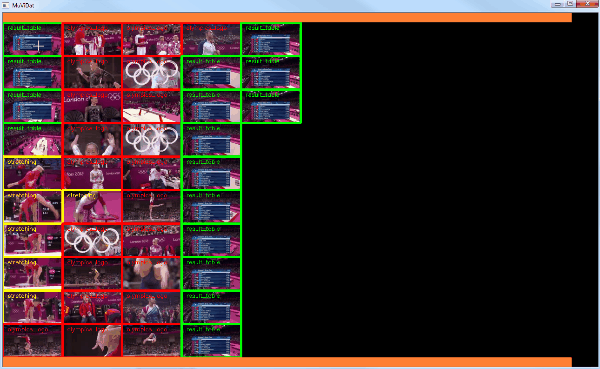
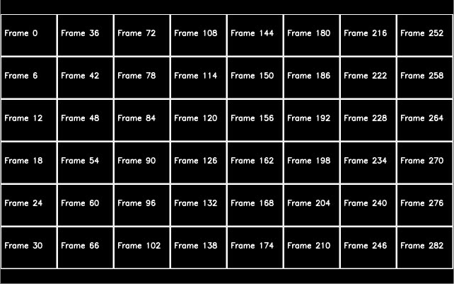

# MuViLab
**MU**ltiple **VI**deos **LAB**elling tool is a manual [annotation tool](https://en.wikipedia.org/wiki/List_of_manual_image_annotation_tools) to help you labelling videos for computer vision, machine learning, deep learning and AI applications. With MuViLab you can annotate hours of videos in just a few minutes!

## Key features
- Show several video clips on screen, simultaneously, in loop
- Create labels with a simple click
- Designed for labelling a few events among many negative examples (i.e. lightinings in a video of weather monitoring)
- Export annotation to a json file
- Review labels in a single page

Once you annotate your videos, you can use any stardard library like [Tensorflow](https://www.tensorflow.org/) to train your algorithm.

## Why use MuViLab?
### Several hours of repetitive video
Immagine you've got days or months of video recording from some source (e.g. video surveillance, health monitoring, weather webcam...) and you're interested in an algorithm that classifies a specific event (e.g. a red car crosses the street, a thunder in the sky...). With standard annotation tools, you have to watch the entire video to observe and label the event. Sometimes, the event you're annotating is so quick that you cannot even speed up your videos, requiring you to watch them at normal speed.

With MuViLab, you can split your long video into short clips of 3-4 seconds, which are shown simultaneously in loop on screen. **With a single glance, you'll be able to identify your event in ~100 clips, speeding up your job by almost 100 times!**

<link rel="img_src" href="doc/media/annotate.gif" />


After annotating your videos, you can use the *review function* to check and modify your labels:


## Installation
Simply install the following required pagackes:

    $ pip install opencv-python numpy pytube tqdm matplotlib
    
and run the demo:

    $ python examples/example_youtube_olympics.py

The `pytube` package is only needed to download a youtube video to run the demo.

## Basic usage
To start MuViLab, simply import the class `Annotator` into your script and set up the labels and the folder 
containing the video clips. Labels must be a list of dictionaries in the form of `{'name': 'My_Label', 'color': (255,
 255, 255)}`, where `'name'` is your custom name for each annotation and `'color'` is a BGR colour triplet in the 
 interval 
`[0, 255]`. 
The method `.video_to_clips()` allows you to convert a long video into several short clips. If you already have several clips to annotate, skip this step and simply run `main()`:

```python
from annotator import Annotator
# Define the labels
labels = [{'name': 'text_of_label_1', 'color': (0, 255, 0)},
        {'name': 'text_of_label_2', 'color': (0, 0, 255)},
        {'name': 'text_of_label_3', 'color': (0, 255, 255)}]
# Initialise MuViLab
clips_folder = './clips'
annotator = Annotator(labels, clips_folder, annotation_file='my_labels.json')
# Split the main video into clips
annotator.video_to_clips('long_video.mp4', clips_folder, clip_length=90, overlap=0, resize=0.5)
# Run the GUI
annotator.main()
```

## Clips order
The video clips are shown in a vertical order from the top left to the bottom right corner:


## Keyboard commands
While running, the following keyboard commands will be accepted by the GUI:

- **[1-9]**: Select a label to annotate videos
- **Left Click**: Apply selected annotation
- **Right Click**: Remove annotation
- **N**: Go to the **n**ext page
- **B**: Go **b**ack to the previous page
- **G**: **G**o to a specific page
- **R**: Enter/exit **r**eviewing mode
- **Q**: **Q**uit the program

Labels will be automatically saved when changing page or quitting the program.

A status file will also be saved including the last video that was labelled. Future runs of the application will start from the last annotated page.

## Advanced usage
Additional parameters can be set when initialising `Annotator`:

- **videos\_folder**: A string indicating the folder path containing the video clips. MuViLab will automatically scan every sub-folder looking for videos.
- **annotation\_file**: A string containing the name of the file where the annotations will be saved. Default value: `'labels.json'`
- **status\_file**: A string containing the name of the file where the status of each session is saved (i.e. last video annotated). Default value `'status.json'`
- **video\_ext**: List of strings containing the file extension of the video clips to load in the annotator. Default value: `['.mp4', '.avi']`
- **sort\_files\_list**: A boolean variable. If `True`, the video files in each folder will be sorted alphabetically, otherwise they will be shown according to the default order of the file system. Default value: `True`.
- **N\_show\_approx**: Integer number of clips to show simultaneously on screen. This number is approximate because MuViLab will try to fill completely the grid of videos according to the screen ratio selected. Example: if `N_show_approx=8` and the window is square, a total 9 clips will be shown instead. Default value: `100`
- **screen\_ratio**: Floating number describing the ratio (W/H) of the GUI window. MuViLab will try to fill a window of this ratio using a number of clips as close as possible to `N_show_approx`. Default value: `16/9`
- **image\_resize**: A floating number between `]0, inf[` to resize the video clips when showing them on screen. The size of the clips will scaled by this factor. Example: `resize=0.5` will _reduce_ the size by 50%, `resize=1.5` will _increase_ the size by 50%. Default value: `1`
- **loop\_duration**: Floating number describing the duration of each loop, in seconds, for the clips shown on screen. If set to `None`, the duration of the loop will be automatically deduced by the frame-rate of each clip. Default value: `None`

MuViLab is designed to work with several short-length clips. You can use the method `.video_to_clips()` to convert a single long video into several custom-length clips. The method takes the following arguments as input:

- **resize**: A floating number between `]0, inf[` to resize the video clips. The size of the clips will be the size of the target video scaled by this factor. Example: `resize=0.5` will _reduce_ the size by 50%, `resize=1.5` will _increase_ the size by 50%. Default value: `1`
- **overlap**: A floating number between `[0, 1[` to generate overlapping clips. Example: if `overlap=0.5` the clips will overlap by 50%, producing clip 1 with frames (1,2,3,4,5,6), clip 2 with frames (4,5,6,7,8,9), clip 3 with frames (7,8,9,10,11,12) and so on. Default value: `0`
- **clip\_length**: An integer number of frames indicating the length of each clip. This parameter does not affect the playback speed during annotations, that can be adjusted with `loop_duration` when initialising `Annotator`. Default value: `90`

Once video clips are generated, every next usage of MuViLab does not need to call `.video_to_clips()` again.

## License
MuViLab was developed while working for the [SPHERE IRC project](https://www.irc-sphere.ac.uk/). 
MuViLab is freely available for free non-commercial use, and may be redistributed under these conditions. For commercial queries, please [contact me](mailto:a.masullo@bristol.ac.uk).
